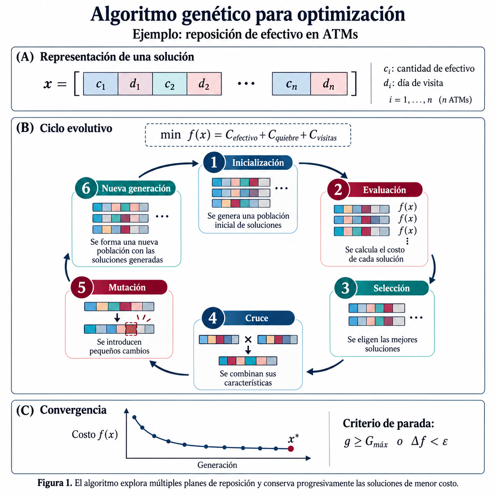

# Algoritmo genético para la reposición de efectivo en cajeros automáticos

Implementación didáctica de un algoritmo genético aplicado a un problema real de la industria bancaria: decidir **cuánto efectivo cargar en cada cajero** y **cada cuántos días visitarlo**.



*Esquema del modelo. En esta implementación, la decisión temporal representa el intervalo entre visitas (de 1 a 14 días) y la ejecución termina tras 300 generaciones; no se aplica parada anticipada por convergencia.*

Los datos son simulados. El código es Python puro: solo `random`, `math`, `csv` y `os`. No hay dependencias que instalar.

## El problema

Una red de 40 cajeros. Para cada uno hay que fijar dos decisiones. Tres costos empujan en direcciones contrarias:

| Componente | Baja cuando… | Sube cuando… |
|---|---|---|
| Efectivo inmovilizado | se cargan montos pequeños | se cargan montos grandes |
| Transporte de valores | se visita poco | se visita seguido |
| Desabastecimiento | se carga mucho y se visita seguido | se carga poco o se visita poco |

Minimizar los dos primeros empeora el tercero. No hay fórmula cerrada, y el espacio de búsqueda es del orden de `(montos × frecuencias)^40` — imposible de enumerar.

## Estructura

```
generar_datos.py       genera atms.csv (semilla fija)
modelo.py          función de costo y política de referencia
ga.py              el algoritmo genético
main.py            corre el experimento y compara contra la referencia
validar.py         valida la fórmula cerrada contra Monte Carlo
atms.csv          40 cajeros simulados
resultados/            planes y curva de convergencia (CSV)
```

## Cómo correrlo

```bash
# Desde la carpeta del proyecto, con Python 3:
python3 generar_datos.py   # opcional: regenera los datos simulados incluidos
python3 main.py            # ~2 segundos
python3 validar.py         # opcional
```

## Cómo está modelado el algoritmo

**Cromosoma.** Una lista de 40 genes, uno por cajero. Cada gen es un par de índices `(monto, frecuencia)` que apuntan a la rejilla de valores válidos *de ese cajero*. Trabajar con índices en lugar de valores garantiza que todo cromosoma es factible: nunca se carga más que la capacidad del dispensador, ni siquiera después de mutar.

**Selección por torneo (k=3).** Se toman tres individuos al azar y gana el de menor costo. Deja que soluciones mediocres sobrevivan de vez en cuando, lo que preserva diversidad.

**Cruce uniforme.** Cada cajero se hereda de un padre o del otro. Es lo apropiado aquí porque los genes son casi independientes: la decisión del ATM-007 no depende de la del ATM-032. Un cruce de un punto introduciría un sesgo posicional sin justificación de negocio.

**Mutación local.** Un gen se mueve uno o dos pasos en la rejilla, no salta a un valor aleatorio. Funciona como una búsqueda local dentro del ciclo evolutivo y evita destruir buenas soluciones en generaciones avanzadas.

**Elitismo (2).** Los dos mejores pasan intactos, para que la mejor solución nunca empeore entre generaciones.

## La función de costo

El faltante esperado por ciclo se calcula con la forma cerrada de la pérdida parcial de la normal:

```
D ~ Normal(μ = f·demanda_media,  σ = demanda_desv·√f)
z = (monto − μ) / σ
E[(D − monto)⁺] = σ · (φ(z) − z·(1 − Φ(z)))
```

Usar la fórmula en lugar de simular hace la evaluación determinística y unas mil veces más rápida, que es lo que permite evaluar cientos de miles de planes en segundos. `validar.py` compara esa aproximación contra una simulación día a día; en la validación ejecutada, la brecha absoluta promedio fue 0,74 % y la máxima 2,02 % (8 casos, 4000 réplicas por caso).

## Resultado de la corrida incluida

Comparación contra una política de referencia uniforme (visitar todos los cajeros cada 7 días, cargarlos al 85 % de su capacidad), sobre un horizonte de 90 días:

| | Política uniforme | Plan del GA |
|---|---|---|
| Efectivo inmovilizado | 5,6 M | 6,3 M |
| Transporte de valores | 36,5 M | 24,2 M |
| Desabastecimiento | 4,2 M | 0,7 M |
| **Costo total** | **46,3 M** | **31,2 M** |
| Visitas en el período | 514 | 364 |
| Peor probabilidad de desabasto | 56 % | 3,6 % |

Lo interesante no es el porcentaje de ahorro, que depende por completo de qué tan mala sea la política de comparación. Es el patrón: **el GA hace menos visitas y aun así falla mucho menos**, porque deja de tratar a los 40 cajeros como si fueran iguales. Concentra las visitas donde la demanda es alta y variable, y espacia las de los cajeros rurales, donde cada visita es tres veces más cara.

## Advertencias

- Los datos son **simulados**. Los órdenes de magnitud son plausibles, pero ningún número aquí proviene de una operación real.
- Los parámetros de negocio (tasa de oportunidad, costo por colón no dispensado, costo por evento de desabasto) están en la cabecera de `modelo.py` y son los primeros que habría que calibrar con datos propios.
- El modelo asume demanda estacionaria e independiente entre días. En la práctica hay estacionalidad fuerte (quincenas, feriados, pago de aguinaldos) que cambiaría bastante el resultado.
- Un algoritmo genético entrega una solución **buena**, no la óptima. Para instancias chicas conviene comparar contra un modelo exacto y medir la brecha.

## Licencia

MIT.
